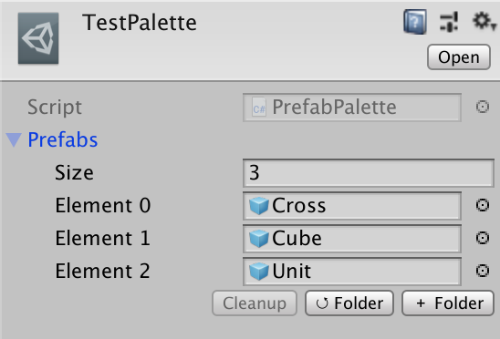
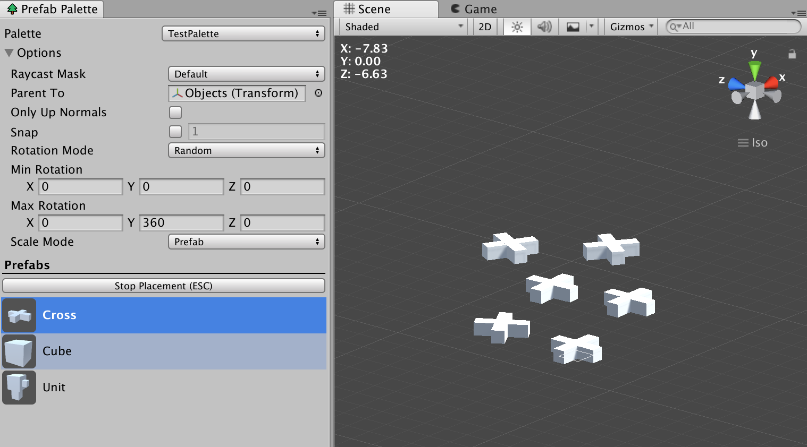

# **PrefabPalette**
This tool provides you with a handy tool for building scenes in Unity, as an alternative to dragging prefabs into your scene one-by-one.

### **Creating a Palette**

First, you create a `PrefabPalette`, which is a group of objects that you will be able to place into the scene.

> **Assets ➞ Create ➞ Prefab Palette**

Once you have a palette, you can add objects to it from its inspector view.

You can press `＋ Folder` to add all prefabs located in a folder. After, you can press `↺ Folder` will reload from that folder.

Once you've had a palette, you want to open the PrefabPalette window.

> **Window ➞ Prefab Palette**

From here, you can select which palette you want to use, and which object you want to place in the scene.

### **Placing Prefabs**

When placing an object, you will see a preview of where you'll place it, and you can click multiple times to *stamp* the object.

The mouse raycasts into the scene to find where to place the object. This makes it easy for you to place objects directly onto your level geometry.

You can select which objects are are raycasted against by modifying the `Raycast Mask` property.

### **Place on Only Floors**

If you check `Only Up Normals`, the placement will only consider surfaces that are facing upwards, which is useful if you only want to place objects onto floors.

### **Rotation & Scale**

The `Rotation Mode` and `Scale Mode` parameters are handy tools which let you control the rotation and size of the objects when you place them. In the screenshot above, I have chosen to have each object I place randomly rotated up to 360 degrees on the Y-axis.

### **Default Scene Controls**

If you want to return to Unity's default scene controls, press `Stop Placement` or the `Escape` key.
